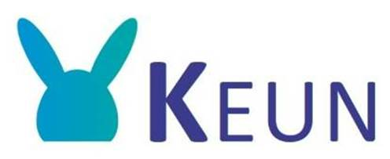

# 

**Keun** ([West Flemish](https://en.wikipedia.org/wiki/West_Flemish) for [rabbit](https://anw-ivdnt-org.translate.goog/article/keun?_x_tr_sl=nl&_x_tr_tl=en&_x_tr_hl=nl&_x_tr_pto=wapp)) is a web based modern variant of the [Usagi](https://www.ohdsi.org/web/wiki/doku.php?id=documentation:software:usagi) OMOP [CDM](https://www.ohdsi.org/data-standardization/) mapping tool.

THIS IS ALPHA SOFTWARE (almost production ready)

# Introduction

Although [Usagi](https://www.ohdsi.org/web/wiki/doku.php?id=documentation:software:usagi) does the job, it has some issues:

- It is slow (especially when loading large CSV's)
- You need to install the dictionaries from Athena
- It requires software installation (Java)
- No [four-eye principle](https://en.wiktionary.org/wiki/four-eye_principle)
- It doesn't do translations
- The search result of Usagi are not on par with [Athena](https://athena.ohdsi.org/)

Therefore we decided to make a modern web variant of Usagi:

- No installation, just run it from your browser
- Made with [Svelte](https://svelte.dev/): cybernetically enhanced web apps
- Includes the super fast [svelte-datatable](https://github.com/RADar-AZDelta/svelte-datatable) component. So it can handle very, very lage CSV files. It uses the [Arquero](https://uwdata.github.io/arquero/) library in a web worker.
- Uses [Athena](https://athena.ohdsi.org/) in the background
- Translation are done by [Bergamot](https://browser.mt/): machine translation done locally in your browser

# Tutorial

https://github.com/RADar-AZDelta/Keun/assets/71939691/6bced370-81fe-4c89-afde-48acb28d7450

# Setup

If you want to setup Keun locally on your own device you will need to provide some information in the .env file. The following values are required

```bash
PUBLIC_MAPPINGDATA_PATH= This is the route to the API for your concepts
PUBLIC_ATHENA_DETAIL= This is the detail page of concepts
```

# License

Copyright © 2023 [RADar-AZDelta](mailto:radar@azdelta.be).
Released under the [GNU General Public License v3.0](LICENSE).
